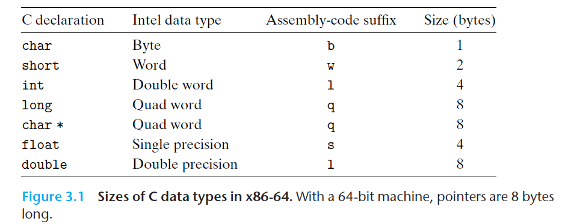
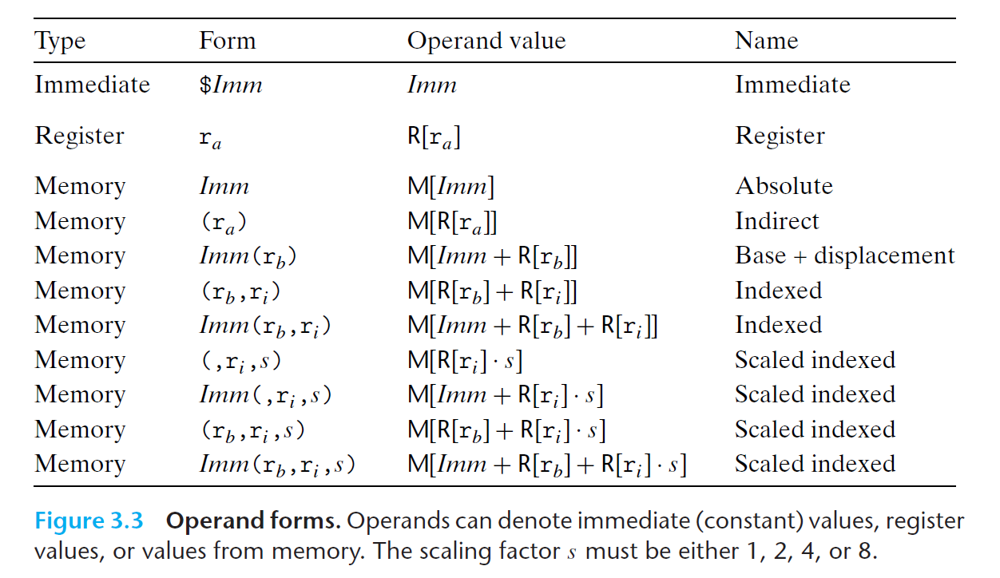
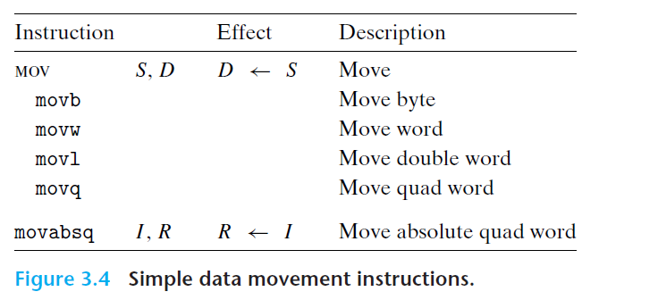

# AT&T 汇编

## 1. 数据格式
AT&T汇编指令有一个表示操作数长度的字符后缀
| C 声明 | 汇编代码后缀  |  大小（字节）|
| --- | --- | --- |
| `char` | b | 1 |
| `short` | w | 2 |
| `int` | i | 4 |
| `long` | q | 8 |
| `char*` | q | 8/4 |
| `float` | s | 4 |
| `double` | l | 8 |

## 2. 操作数格式
<!-- | 类型 | 格式 | 操作数 | 名称 | 样例（GAS = C语言）|
| --- | --- | ---- | ----- | ---- |
| 立即数寻址 | $Imm | Imm | 立即数寻址 | `$1 = 1` |
| 寄存器寻址 | $r_a$ |  -->

## 3. 数据转移

## 参考
- 《深入理解计算机系统》--3.2小节