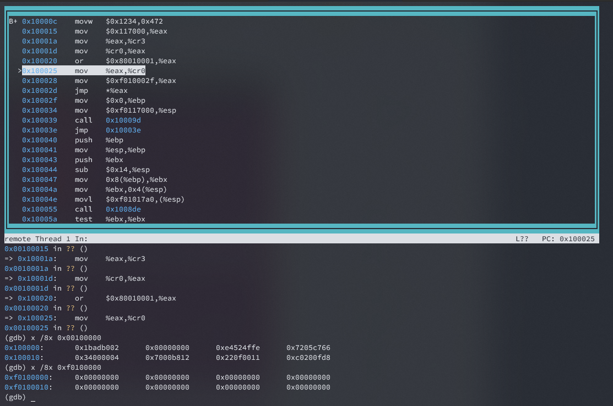

# Lab1: Booting a PC

## Introduction
实验1分为3部分。第一部分，了解基本的X86汇编，QEMU模拟器的使用，以及计算机的启动过程。第二部分调试测试bootloader（在 `boot` 文件夹下的代码）。最后了解6.828的内核初始化的过程（`kernel` 目录）


### Software Setup
获取实验代码
```bash
athena% mkdir ~/6.828
athena% cd ~/6.828
athena% add git
athena% git clone https://pdos.csail.mit.edu/6.828/2018/jos.git lab
Cloning into lab...
athena% cd lab
```

代码测试，完成实验可以使用 `make grade` 命令测试是否通过


## Part 1: PC Bootstrap
第一部分不需要写代码，只是通过QEMU和GDB调试，了解启动过程。这一部分虽然不需要写代码，但是读懂这部分的前提是需要大量的前置知识。

### Getting Started with x86 assembly

[X86汇编参考手册](https://pdos.csail.mit.edu/6.828/2018/readings/pcasm-book.pdf). X86汇编的语法格式有Intel和AT&T两种，上述参考手册中使用的是NASM汇编器（Intel）语法，而GNU的汇编器使用的是AT&T语法。我们使用GCC编译内核代码，所以在C语言中内嵌汇编通常使用AT&T格式的， [Brennan's Guide to Inline Assembly](http://www.delorie.com/djgpp/doc/brennan/brennan_att_inline_djgpp.html)


**Exercise1**:
> 根据[参考资料](https://pdos.csail.mit.edu/6.828/2018/reference.html)熟悉X86的汇编，再后续的学习中会经常需要使用的参考页面提供的资料。 推荐阅读 [Brennan's Guide to Inline Assembly](https://www.delorie.com/djgpp/doc/brennan/brennan_att_inline_djgpp.html) 的 "The Syntax" 章节。

### Simulating the x86
使用QEMU模拟器开发一个操作系统，QEMU内置的输出窗口调试功能有限，我们可以使用GDB远程连接QEMU进行调试，具体操作如下：

```bash
git clone https://pdos.csail.mit.edu/6.828/2018/jos.git lab 
cd lab
make
+ as kern/entry.S
+ cc kern/entrypgdir.c
+ cc kern/init.c
+ cc kern/console.c
+ cc kern/monitor.c
+ cc kern/printf.c
+ cc kern/kdebug.c
+ cc lib/printfmt.c
+ cc lib/readline.c
+ cc lib/string.c
+ ld obj/kern/kernel
+ as boot/boot.S
+ cc -Os boot/main.c
+ ld boot/boot
boot block is 382 bytes (max 510)
+ mk obj/kern/kernel.img
```
编译后会生成磁盘镜像文件 (`obj/kern/kernel.img`)，启动QEMU时会加载改文件。这个镜像文件包含了bootloader（`obj/boot/boot`） 和内核（`obj/kernel`）.

启动qemu
```bash
make qemu
```
或
```bash
make qemu-nox
```
这两个命令的区别，前者会有一个独立的qemu终端窗口出现，而后者没有独立的终端窗口，信息显示在当前的终端中。
这个内核目前只有两条命令，`help` 和 `keninfo` , 使用 `Ctrl+a, x`退出

```bash
sed "s/localhost:1234/localhost:26000/" < .gdbinit.tmpl > .gdbinit
***
*** Use Ctrl-a x to exit qemu
***
qemu-system-i386 -nographic -drive file=obj/kern/kernel.img,index=0,media=disk,format=raw -serial mon:stdio -gdb tcp::26000 -D qemu.log 
6828 decimal is XXX octal!
entering test_backtrace 5
entering test_backtrace 4
entering test_backtrace 3
entering test_backtrace 2
entering test_backtrace 1
entering test_backtrace 0
leaving test_backtrace 0
leaving test_backtrace 1
leaving test_backtrace 2
leaving test_backtrace 3
leaving test_backtrace 4
leaving test_backtrace 5
Welcome to the JOS kernel monitor!
Type 'help' for a list of commands.
K> help
help - Display this list of commands
kerninfo - Display information about the kernel
K> kerninfo
Special kernel symbols:
  _start                  0010000c (phys)
  entry  f010000c (virt)  0010000c (phys)
  etext  f010178e (virt)  0010178e (phys)
  edata  f0119300 (virt)  00119300 (phys)
  end    f0119940 (virt)  00119940 (phys)
Kernel executable memory footprint: 103KB
K> QEMU: Terminated
```


内核基本信息：
| 描述 | 虚拟地址 | 物理地址 |
| --- | --- | --- | 
| _start |  | 0010000c|
| entry | f010000c | 0010000c |
| etext | f0119300 | 00119300 |
| edata | f010000c | 0010000c |
| end | f0119940 | 00119940 |


### The PC's Physical Address Space
32bit(4GB) 物理内存布局
```text
+------------------+  <- 0xFFFFFFFF (4GB)
|      32-bit      |
|  memory mapped   |
|     devices      |
|                  |
/\/\/\/\/\/\/\/\/\/\

/\/\/\/\/\/\/\/\/\/\
|                  |
|      Unused      |
|                  |
+------------------+  <- depends on amount of RAM
|                  |
|                  |
| Extended Memory  |
|                  |
|                  |
+------------------+  <- 0x00100000 (1MB)
|     BIOS ROM     |
+------------------+  <- 0x000F0000 (960KB)
|  16-bit devices, |
|  expansion ROMs  |
+------------------+  <- 0x000C0000 (768KB)
|   VGA Display    |
+------------------+  <- 0x000A0000 (640KB)
|                  |
|    Low Memory    |
|                  |
+------------------+  <- 0x00000000
```

PC启动时是16bit的实模式，最大寻址空间是1MB。然后通过一系列的设置可以突破1MB的限制，进入32bit的保护模式，寻址空间达到4GB.为了保持向后兼容，即使32bit模式下，物理内存的0~1MB地址空间还是或实模式的分布一样的，JOS系统只使用了256MB的物理内存。


### The ROM BIOS

使用qemu调试，观察启动过程。打开两个终端窗口，在第一个终端中以debug的方式启动qemu （`make qemu-gdb` 或 `make-qemu-nox-gdb`），在第二个终端中使用gdb调试：
```bash
make gdb
gdb -n -x .gdbinit
GNU gdb (Ubuntu 9.2-0ubuntu1~20.04.1) 9.2
Copyright (C) 2020 Free Software Foundation, Inc.
License GPLv3+: GNU GPL version 3 or later <http://gnu.org/licenses/gpl.html>
.....
For help, type "help".
Type "apropos word" to search for commands related to "word".
+ target remote localhost:26000
warning: No executable has been specified and target does not support
determining executable automatically.  Try using the "file" command.
warning: A handler for the OS ABI "GNU/Linux" is not built into this configuration
of GDB.  Attempting to continue with the default i8086 settings.

The target architecture is assumed to be i8086
[f000:fff0]    0xffff0: ljmp   $0xf000,$0xe05b
0x0000fff0 in ?? ()
+ symbol-file obj/kern/kernel
(gdb) 
```

这是执行的第一条汇编指令：
```s
[f000:fff0]    0xffff0: ljmp   $0xf000,$0xe05b
```
从这条指令中我们可以得到以下信息：
- PC 启动时开始执行的物理内存地址是 0x000f_fff0，这个地址对应的就是BIOS的位置
- PC 开始执行指令时对应的代码段 `CS=0xf000`, 指令指针 `IP=0xfff0` , `i reg` 查看寄存器的值
- 第一条指令是一条 `jmp` 指令，它会跳转到 `CS=0xf000` ，`IP=0xe05b` 处

为什么是 `0xffff0`？这是一个固定的地址，x86架构就是这样设计的，具体参考[PC Booting](https://en.wikipedia.org/wiki/Booting)

**Exercise2:**
> 使用GDB的 `si`(Step Instruction)命令调试ROM BIOS, 了解BIOS的流程，可能用到的参考资料 [Phil Storrs I/O Ports Description](http://web.archive.org/web/20040404164813/members.iweb.net.au/~pstorr/pcbook/book2/book2.htm)

BIOS具体执行的指令


BIOS主要就是完成初始化硬件的工作，之后查询磁盘的启动分区，找到有效的启动分区，将其加载到内存中，最后将控制权移交给启动boot loader.

使用 `si` 和 `x /Ni addr` 指令查看BIOS执行的指令, 使用 `layout asm` 可以显示汇编代码，但是在进入保护模式之前，显示的汇编指令并不是真正执行的汇编指令，`ctrl + x, a` 回到正常模式

```asm
0xffff0: ljmp   $0xf000,$0xe05b  # 第一条指令， 跳转到 0xf000:0xe05b
0xfe05b: cmpl   $0x0,%cs:0x6ac8  #根据cs:0x6ac8是否为0，进行跳转
0xfe062: jne    0xfd2e1          
0xfe066: xor    %dx,%dx    # dx 清零
0xfe068: mov    %dx,%ss    # ss 置零
0xfe06a: mov    $0x7000,%esp  
0xfe070: mov    $0xf34c2,%edx
0xfe076: jmp    0xfd15c
0xfd15c: mov    %eax,%ecx
0xfd15f: cli                # 关闭中断
0xfd160: cld                # 设置指令增长方向
0xfd161: mov    $0x8f,%eax
0xfd167: out    %al,$0x70   # 0x70 和 0x71是用于操作CMOS的端口
0xfd169: in     $0x71,%al   # 上面三条指令是用于关闭不可屏蔽中断
0xfd16b: in     $0x92,%al   # 打开A20
0xfd16f: out    %al,$0x92
0xfd171: lidtw  %cs:0x6ab8  # 将0xf6ab8处的数据读入到中断向量表寄存(IDTR)
0xfd177: lgdtw  %cs:0x6a74  # 并将0xf6a74的数据读入到全局描述符表格寄存器(GDTR)中
0xfd17d: mov    %cr0,%eax
0xfd180: or     $0x1,%eax
0xfd184: mov    %eax,%cr0   # CR0 置位，开启保护模式
0xfd187: ljmpl  $0x8,$0xfd18f  # 长跳转，刷新指令流水，进入保护模式
# The target architecture is assumed to be i386， 下面指令是在保护模式下执行
0xfd18f: mov    $0x10,%eax  # 进入保护模式后需要重新加载段寄存器和gdtr
0xfd194: mov    %eax,%ds
0xfd196: mov    %eax,%es
0xfd198: mov    %eax,%ss
0xfd19a: mov    %eax,%fs
0xfd19c: mov    %eax,%gs
0xfd19e: mov    %ecx,%eax
# ...
```

最后总结BIOS做的事情：

初始化IDT和GDT
初始化VGA设备，PCI bus挂载的各类设备
找到物理存储设备，并且找到一个bootable disk，将运行的权利转移到disk。

## Part 2: The Boot Loader
软盘或硬盘操作的最小单位是扇区（512byte）. 第一个扇区叫做启动扇区，bootloder代码就存放在512byte的空间中。如果是有效的启动扇区（最后两个字节为 `0x55`, `0xAA` 为有效启动扇区），BIOS就会将这512byte加载到0x7c00起始的物理内存地址，并跳转到此处执行 `CS=0x000:IP=0x7c00`. `0x7c00` ，又是一个看来奇怪又随意的地址，同样这也是一个固定的地址，具体参考[Why BIOS loads MBR into 0x7C00 in x86 ?](https://www.glamenv-septzen.net/en/view/6).


在6.828的lab中，bootloader的代码包括一个汇编文件(`boot/boot.S`)和一个c文件（`boot/main.c`）.Bootloader 主要完成以下两个功能：
1. 实现16bit实模式到32bit的保护模式切换，因为只有在保护模式下才能够访问1MB以外的内存空间。
2. bootloader通过I/O指令从IDE硬盘中读取内核

在了解了bootloder的源码后，可以查看对应的反汇编的代码（`obj/boot/boot.asm`），这个反汇编的文件在每条汇编指令前又对应的物理地址。同样的，内核代码的反汇编文件（`obj/kern/kernel.asm`）也类似。

**可能需要使用的GDB 命令**：  
- 使用`b`命令在GDB调试中设置断点，比如在`b *0x7c00` 表示在地址0x7c00处设置断点。
- 使用`c` 指令继续执行直到断点处停下来
- 使用 `si` 执行一条汇编指令
- 使用 `si N `执行 N 条汇编指令
- `x/Ni ADDR` 查看从ADDR处开始的N条指令

**Exercise3:**
> 调试需要使用GDB命令，可参考[ lab tools guide](https://pdos.csail.mit.edu/6.828/2018/labguide.html) . 调试 `boot/boot.S` 和 ` boot/main.c` 回答下面的问题。

- 处理器是从哪里开始执行32bit代码，具体是什么操作使得发生16bit到32bit模式的转换？
  从指令`ljmp    $PROT_MODE_CSEG, $protcseg` 开始执行32bit代码
  ```bash
  (gdb) si
  [   0:7c2d] => 0x7c2d:  ljmp   $0x8,$0x7c32
  0x00007c2d in ?? ()
  (gdb) si
  The target architecture is assumed to be i386
  => 0x7c32:      mov    $0x10,%ax
  0x00007c32 in ?? ()
  (gdb) 
  ```
  16bit到32bit模式的转换: A20, gdt, CR0的PE, 最后跳转指令流水刷新
- bootloader的最后一条指令，以及它加载的kernel的第一条指令是什么？  
  `movw	$0x1234,0x472			# warm boot`
  
- kernel的第一条指令在哪里（地址）？   
  查看b编译后的文件 `obj/kern/kernel.asm` 可知第一条指令 `movw	$0x1234,0x472			# warm boot` 的地址为 `0xf010000c`

- bootloader是怎么知道要从磁盘读取多少个扇区才能把整个kernel加载到内存？  
  这些信息保存到ELF header中，在编译的时候就已经决定了。lab1中是只读了1页（4kB）。 关于elf查看可以使用 `objdump` 和 `readelf` 工具查看。
  查看ELF的头：
  ```bash
  $ i386-jos-elf-readelf -h obj/kern/kernel 
  ELF Header:
  Magic:   7f 45 4c 46 01 01 01 00 00 00 00 00 00 00 00 00 
  Class:                             ELF32
  Data:                              2's complement, little endian
  Version:                           1 (current)
  OS/ABI:                            UNIX - System V
  ABI Version:                       0
  Type:                              EXEC (Executable file)
  Machine:                           Intel 80386
  Version:                           0x1
  Entry point address:               0x10000c
  Start of program headers:          52 (bytes into file)
  Start of section headers:          113064 (bytes into file)
  Flags:                             0x0
  Size of this header:               52 (bytes)
  Size of program headers:           32 (bytes)
  Number of program headers:         2
  Size of section headers:           40 (bytes)
  Number of section headers:         11
  Section header string table index: 8
  ```


ELF 头数据结构：
```c++
struct Elf {
uint32_t e_magic;	   // must equal ELF_MAGIC
uint8_t  e_elf[12];    // Class(1), Data(1), Version(1), OS/ABI Version(1)
uint16_t e_type;      // ELF 文件类型
uint16_t e_machine;   // 平台
uint32_t e_version;   // ELF 版本，一般为0x1
uint32_t e_entry;     // 入口地址
uint32_t e_phoff;     // 程序头表在文件内的字节偏移
uint32_t e_shoff;     // 节头表的偏移字节
uint32_t e_flags;     // 处理器相关标志
uint16_t e_ehsize;    // elf header 的字节大小
uint16_t e_phentsize; // 程序头表中每个条目的字节大小
uint16_t e_phnum;     // 程序头表中条目的数量
uint16_t e_shentsize; // 节头表中每个条目的字节大小
uint16_t e_shnum;     // 节头表的条目数量
uint16_t e_shstrndx;  // string name table 在节头表中的索引
};
 ```


### Loading the Kernel
进一步的介绍bootloader的C语言部分（`boot/main.c`），但是在这之前需要复习一下C语言。

**Exercise4:**
> 复习C语言，特别是指针的部分，推荐 《The C Programming Language by Brian Kernighan and Dennis Ritchie》（K&R）。读这本书的5.1到5.5， 然后运行理解书中的代码（[`pointer.c`](https://pdos.csail.mit.edu/6.828/2018/labs/lab1/pointers.c)）


`pointer.c`
```c
#include <stdio.h>
#include <stdlib.h>

void
f(void)
{
    int a[4];
    int *b = malloc(16);
    int *c;
    int i;

    printf("1: a = %p, b = %p, c = %p\n", a, b, c);

    c = a;
    for (i = 0; i < 4; i++)
	    a[i] = 100 + i;
    c[0] = 200;
    printf("2: a[0] = %d, a[1] = %d, a[2] = %d, a[3] = %d\n",
	   a[0], a[1], a[2], a[3]);

    c[1] = 300;
    *(c + 2) = 301;
    3[c] = 302;
    printf("3: a[0] = %d, a[1] = %d, a[2] = %d, a[3] = %d\n",
	          a[0], a[1], a[2], a[3]);

    c = c + 1;
    *c = 400;
    printf("4: a[0] = %d, a[1] = %d, a[2] = %d, a[3] = %d\n",
	          a[0], a[1], a[2], a[3]);

    c = (int *) ((char *) c + 1);
    *c = 500;
    printf("5: a[0] = %d, a[1] = %d, a[2] = %d, a[3] = %d\n",
	          a[0], a[1], a[2], a[3]);

    b = (int *) a + 1;
    c = (int *) ((char *) a + 1);
    printf("6: a = %p, b = %p, c = %p\n", a, b, c);
}

int
main(int ac, char **av)
{
    f();
    return 0;
}
```

`poibter.c` 的输出
```c++
1: a = 0xffa3a98c, b = 0x570921a0, c = 0x5660cfd0
2: a[0] = 200, a[1] = 101, a[2] = 102, a[3] = 103
3: a[0] = 200, a[1] = 300, a[2] = 301, a[3] = 302
4: a[0] = 200, a[1] = 400, a[2] = 301, a[3] = 302
5: a[0] = 200, a[1] = 128144, a[2] = 256, a[3] = 302
6: a = 0xffa3a98c, b = 0xffa3a990, c = 0xffa3a98d
```


除了C指针相关的内容，还需要了解ELF(Executable Linkable Format)，可参考[the ELF specification ](https://pdos.csail.mit.edu/6.828/2018/readings/elf.pdf)。关于编译链接更深入的知识，推荐阅读[《程序员的自我修养--链接、装载与库》](https://book.douban.com/subject/3652388/)

ELF文件格式：


使用 `objdump` 工具查看elf文件
列出主要的section， 使用 `readelf -S` 列出所有的段
```bash
objdump -h obj/kern/kernel 
obj/kern/kernel:     file format elf32-i386

Sections:
Idx Name          Size      VMA       LMA       File off  Algn
  0 .text         0000178e  f0100000  00100000  00001000  2**2
                  CONTENTS, ALLOC, LOAD, READONLY, CODE
  1 .rodata       00000704  f01017a0  001017a0  000027a0  2**5
                  CONTENTS, ALLOC, LOAD, READONLY, DATA
  2 .stab         000044d1  f0101ea4  00101ea4  00002ea4  2**2
                  CONTENTS, ALLOC, LOAD, READONLY, DATA
  3 .stabstr      00008b06  f0106375  00106375  00007375  2**0
                  CONTENTS, ALLOC, LOAD, READONLY, DATA
  4 .data         0000a300  f010f000  0010f000  00010000  2**12
                  CONTENTS, ALLOC, LOAD, DATA
  5 .bss          00000648  f0119300  00119300  0001a300  2**5
                  CONTENTS, ALLOC, LOAD, DATA
  6 .comment      00000011  00000000  00000000  0001a948  2**0
                  CONTENTS, READONLY

```

`VMA`= link address链接地址 = vaddr虚拟地址，`LMA`= load address加载地址 = 物理地址


查看elf文件所有的header:
```bash
 objdump -x obj/kern/kernel  

obj/kern/kernel:     file format elf32-i386
obj/kern/kernel
architecture: i386, flags 0x00000112:
EXEC_P, HAS_SYMS, D_PAGED
start address 0x0010000c

Program Header:
    LOAD off    0x00001000 vaddr 0xf0100000 paddr 0x00100000 align 2**12
         filesz 0x0000ee7b memsz 0x0000ee7b flags r-x
    LOAD off    0x00010000 vaddr 0xf010f000 paddr 0x0010f000 align 2**12
         filesz 0x0000a948 memsz 0x0000a948 flags rw-

  ......

```
`Program Header` 中的 `LOAD` 显示了程序加载的地址以及文件大小

bootloade 就是通过读取elf文件的 `Program Header` 信息决定需要加载的扇区的数量。

在链接是通过参数 `-Ttext 0x7c00` 指定bootloader的加载地址

**Exercise5:**
> 修改bootloader的加载地址，观察会发生什么错误?


会在 `boot/boot.S` 的 `ljmp    $PROT_MODE_CSEG, $protcseg` 指令出错， 以下分别是修改前后的的汇编， 修改的值是 `0x8C00`


除了section的信息，elf header 中的 `e_entry` 也很重要。 它给出了代码开始执行的地方（entry point），通过以下命令查看
```bash
objdump -f obj/kern/kernel 

obj/kern/kernel:     file format elf32-i386
architecture: i386, flags 0x00000112:
EXEC_P, HAS_SYMS, D_PAGED
start address 0x0010000c
```
  
 
使用 `objdump -h` 分别查看 `obj/boot/boot.out` 和 `obj/kern/kernel` , boot的 load address和lingk address是一致的，而 kernel的则是不一样的。

**Exercise6:**
> 使用`x/Nx address`查看 0x00100000 内存中的内容, 1）从BIOS进入bootloader时的内容，2）从bootloader到kernel时的内容


查看 `obj/kern/kernel.asm` 的指令
```asm
entry:
  movw	$0x1234,0x472			# warm boot
f0100000:	02 b0 ad 1b 00 00    	add    0x1bad(%eax),%dh
f0100006:	00 00                	add    %al,(%eax)
f0100008:	fe 4f 52             	decb   0x52(%edi)
f010000b:	e4 66                	in     $0x66,%al

f010000c <entry>:
f010000c:	66 c7 05 72 04 00 00 	movw   $0x1234,0x472
f0100013:	34 12 
```

以第一条指令 `02 b0 ad 1b 00 00`  从左到右地址增加，在GDB的命令显示中，以4个字节为一组显示，
比如 `0x1badb002` ，但是它在从右到左表示的。其实这就是小端序，即低字节存放在地址值，高字节存放在高地址。

## Part 3: The Kernel

这一部分需要写一点点的代码，lab1的代码中有些地方是没有实现的。

### Using virtual memory to work around position dependence

bootloader 的链接地址和加载地址是一样的，但是kernel的链接和加载地址是不一样的，kernel的链接过程比较复杂，所以它是通过链接脚本`kern/kernel.ld` 完成的。为了给用户程序更多的空间，操作系统内核的通常链接和运行在高（虚拟）地址，比如 `0xf0100000`. 但是许多机器可能没有那么多的物理内，所以我们通过处理器的内存管理将 `0xf0100000`(链接地址) 地址映射到 `0x00100000`(加载运行地址)。   
事实上，在下一个实验中，我们会将256MB(0~0xfffffff) 内存映射到 0xf000_0000 ~ 0xffff_ffff.而lab1中我们只是将4MB的内存进行映射。我们使用手动的静态的初始化页目录和页表(`kern/entrypgdir.c`).在开启页机制后，映射关系如下(ph==>vm)：虚拟地址 0xf000_0000~0xf040_0000 和 0x0000_0000~0x0040_0000 都被映射到物理地址的 0x0000_0000~0x0040_0000。 所以在程序中如果访问了任何这两个地址区区间之外的内存都会出错（lab1中没有异常处理程序）。


查看kernel的链接和加载地址
```bash
$ objdump -x obj/kern/kernel

obj/kern/kernel:     file format elf32-i386
obj/kern/kernel
architecture: i386, flags 0x00000112:
EXEC_P, HAS_SYMS, D_PAGED
start address 0x0010000c

Program Header:
    LOAD off    0x00001000 vaddr 0xf0100000 paddr 0x00100000 align 2**12
         filesz 0x0000ee7b memsz 0x0000ee7b flags r-x
    LOAD off    0x00010000 vaddr 0xf010f000 paddr 0x0010f000 align 2**12
         filesz 0x0000a948 memsz 0x0000a948 flags rw-

Sections:
Idx Name          Size      VMA       LMA       File off  Algn
  0 .text         0000178e  f0100000  00100000  00001000  2**2
```


在下一个lab中，会将整个25MB内存的0x00000000~0x0fffffff 映射到 0xf0000000~0xffffffff 

现在只对4MB进行映射，我们是通过手动静态初始化页目录和页表`kern/entrypgdir.c`.
在没有开启分页功能 `CR0_PG` （`kern/entry.S`）之前，内存地址被认为就是物理内存的地址。而一旦打开分页功能，程序中使用的的就是虚拟地址，虚拟地址和物理地址的转换是通过 `entry_pgdir` 完成的。因为这里只使用了4MB地址，所以映射关系只有 0x00000000 ~ 0x00400000  到 0xf0000000 ~ 0xf0400000 .超过这个范围的内存访问会出现错误（还未设置异常处理）。  


关于分页机制的内存映射


目前lab1仅仅初始化了page directory中的两条数据，和page table中所有的数据：


**Exercise7:**
> 调试 JOS kernel， 并在 `movl %eax, %cr0` （`kern/entry.S`）停下来查看内存 0x00100000 和 0xf0100000。使用`si` 单步执行命令，再此查看这两个内存地址。理解这个语句发生了什么。
> 如果没有成功建立内存映射第一条崩溃的指令是什么？把 `movl %eax, %cr0` 注释掉，验证你的猜测是否正确？




注释之后奔溃的指令
```asm
	mov	$relocated, %eax
f0100025:	b8 2c 00 10 f0       	mov    $0xf010002c,%eax
	jmp	*%eax
f010002a:	ff e0                	jmp    *%eax
```
`movl %eax, %cr0` 是打开内存分页操作的，注释之后内存`0xf010002f`就无法映射，自然就会崩溃


### Formatted Printing to the Console

在使用C语言编写用户程序时，` printf()` 被认为理所当然的。但是在编写内核时所有的I/O操作都需要自己实现。阅读  `kern/printf.c`, `lib/printfmt.c`, 和` kern/console.c`，理解它们之间的关系。

- `console.c` 硬件层的驱动，直接读写显存
- `printf.c` 提供类似与libc中的printf用户API
- `printfmt.c` 格式化打印，由`printf.c` 中的打印函数调用


**Exercise8:**
> 在打印功能的实现中，使用 `%o` 打印八进制数据的部分没有实现，找到它并补充这部分代码。 

很显然格式化字符的功能是在 `printfmt.c` 文件的`vprintfmt` 函数中,参照16进制打印的补全代码：
```c
	// (unsigned) octal
		case 'o':
			// Replace this with your code.
			num = getuint(&ap, lflag);
			base = 8;
			goto number;
			break;
```

<!-- TODO print函数的变长参数的实现 -->


回答下面问题：
1. 解释`printf.c` 和 `console.c` 的接口，具体而言就是 `console.c` 提供了哪些接口，`printf.c` 是怎么使用这些接口的？  
   `printf.c` 调用`console.c`中的`cputchar` 函数进行显示输出。

2. 解释下面`console.c`的代码片段：
   ```c
    if (crt_pos >= CRT_SIZE) { 
      int i;
      memmove(crt_buf, crt_buf + CRT_COLS, (CRT_SIZE - CRT_COLS) * sizeof(uint16_t));
      for (i = CRT_SIZE - CRT_COLS; i < CRT_SIZE; i++)
        crt_buf[i] = 0x0700 | ' ';
      crt_pos -= CRT_COLS;
    }
   ```
   实现滚屏操作，当一个屏幕满了，向上滚动一行  
3. 单步执行下面的语句
   ```c
   int x = 1, y = 3, z = 4;
   cprintf("x %d, y %x, z %d\n", x, y, z);
   ```
   - 在 `cprintf` 调用中，`fmt` 和 `ap` 分别指向什么？
   - 列出 `cons_putc`, `va_arg`和`vcprintf`每次调用的参数变化。


进入内核后可以使用vscode调试，添加`launch.json`
```json
{
    // Use IntelliSense to learn about possible attributes.
    // Hover to view descriptions of existing attributes.
    // For more information, visit: https://go.microsoft.com/fwlink/?linkid=830387
    "version": "0.2.0",
    "configurations": [
        {
            "name": "gdb - Debug kernel",
            "type": "cppdbg",
            "request": "launch",
            "program": "${workspaceFolder}/obj/kern/kernel",
            "args": [],
            "stopAtEntry": false,
            "cwd": "${workspaceFolder}",
            "environment": [],
            "externalConsole": false,
            "MIMode": "gdb",
            "miDebuggerServerAddress": "localhost:26000",
            "setupCommands": [
                {
                    "description": "Enable pretty-printing for gdb",
                    "text": "-enable-pretty-printing",
                    "ignoreFailures": true
                },
                {
                    "description": "Set Disassembly Flavor to Intel",
                    "text": "-gdb-set disassembly-flavor intel",
                    "ignoreFailures": true
                },
                {
                    "description": "Load .gdbinit",
                    "text": "-x .gdbinit",
                    "ignoreFailures": true
                }
            ],
            "miDebuggerPath": "/usr/bin/gdb"
        }
    ]
}
```
修改 `.gdbinit.tmpl` 文件, 注释下面两行
```ini
#echo + target remote localhost:1234\n
#target remote localhost:1234
```
如果使用 `gdb`调试，需要把注释去掉，或是在启动gdb后手动连接 


使用vscode调试，在 `vprintfmt` 和  `const_putc` 中打断点可观察到 cons_putc, va_arg和vcprintf每次调用的参数变化。


4. 运行下面代码：
   ```c
   unsigned int i = 0x00646c72;
   cprintf("H%x Wo%s", 57616, &i);
   ```
   输出是什么?这里的输出涉及到CPU是大端还是小端字节序的问题  
   ASCII码0x72='r', 0x6c='l',0x64='d',0x00='\0'(null)
   输出的是 `He110 World`
5. 在下面的代码中，在打印输出的内容中`y=` 后面的是什么？
   ```c
   cprintf("x=%d y=%d", 3);
   ```
   继续输出参数3后面内存空间的值
6. 如果函数压栈的顺序为从左到右，那么cprintf应该怎么修改，使得其能够正确的输出？


**Challenge**
> 增强打印功能，使得可以输出不同颜色的文本。


### The Stack

最后的几个练习将深入的了解stack，并写一个监控函数，可以输出调用栈信息。

**Exercise 9:**
> kernel是在哪里初始化栈，栈的内存空间是在哪里？kernel是如何为栈保留空间的，这段初始程序最后栈的空间分布

在entry.S中有这样一段代码进行初始化：
```c
#part 1
movl    $0x0,%ebp            # nuke frame pointer
                            # exercise 11提示看这个文件内容，发现应该是这个地方暗示着栈的结束。
# Set the stack pointer
movl    $(bootstacktop),%esp

# part 2

bootstack:
    .space        KSTKSIZE
    .globl        bootstacktop   

# part 3
#define KSTKSIZE    (8*PGSIZE)
```

使用GDB调试是执行的指令
```asm
  0xf010002f： mov    $0x0,%ebp        
  0xf0100034： mov    $0xf0118000,%esp   
```
初始的栈顶是 `0xf0118000` 的虚拟地址，对应的物理地址是 `0x00118000`, 栈的大小是32KB。
栈是向下增长的，所以上面给出的是最高地址，从0xf0118000(0x00118000) 向下32KB都是栈空间。  

关于x86的栈指针（esp 寄存器），指向stack的最低地址空间。栈是向下增长的，所以push一个数，esp是减小的，pop是增大。在32bit模式中，出入栈操作的都是4个字节。


函数调用时，会有两个固定的指令
```asm
push   %ebp
mov    %esp,%ebp
```

这两条指令就可以使我们能够追踪函数调用关系，具体原理参考函数调用栈帧示意图：


在栈帧的内存示意图中可以看到，帧指针(ebp) 类似于链表数据结构中的头节点，它保存的使上一个调用栈的指针，依次类推，就能回溯函数调用关系。


**Exercise 10:**
> 熟悉C语言的调用规则，在 `obj/kern/kernel.asm` 找到 `test_backtrace ` 函数的地址，并在该地址打断点，观察每次调用前后发生了什么？每次的递归调用会有多少个32bit的双字入栈，它们分别是什么？


使用以下命令查看调用栈的信息
- `backtrace/bt` ， 查看栈回溯信息
- `frame n` ：切换栈帧
- `info f n` : 查看栈帧信息


esp变化：0xf0117fe0 0xf0117fc0  0xf0117fa0 0xf0117f80 ....  
每次调用栈指针变化0x20，即8个32bit的双字入栈


经过上面的练习的练习已经能够实现一个stack backtrace(`mon_backtrace()`)，该函数在`kern/monitor.c`文件中。这个函数应该按以下格式显示函数调用栈：
```bash
Stack backtrace:
  ebp f0109e58  eip f0100a62  args 00000001 f0109e80 f0109e98 f0100ed2 00000031
  ebp f0109ed8  eip f01000d6  args 00000000 00000000 f0100058 f0109f28 00000061
  ...
```

`ebp` 是基址指针，`eip` 表示的是函数调用指令的下一条指令的地址， `args` 是函数调用的前5个参数。`mon_backtrace ` 打印的顺序是第一行当前指向的函数，第二行是上一个调用的函数，...., 需要打印所有的调用栈，通过`kern/entry.S` 中的代码可以知道什么时候停止。
需要注意的点就是，我们前面知道ebp初始化为0，因此终止的条件就是0。

通过观察栈空间分布，ebp+1存放的是函数返回地址，从ebp+2开始才是参数。

由于这个函数调用参数是相对固定的，因此我们输出5个参数。

实现的代码：
```c++
// 添加命令
static struct Command commands[] = {
	{ "help", "Display this list of commands", mon_help },
	{ "kerninfo", "Display information about the kernel", mon_kerninfo },
	{ "traceback",  "traceback info", mon_backtrace},
};


int
mon_backtrace(int argc, char **argv, struct Trapframe *tf)
{
	// Your code here.
	cprintf("Stack backtrace:\n");
	struct Eipdebuginfo info;
	uint32_t ebp, eip;
	for (ebp = read_ebp(); ebp != 0; ebp = *((uint32_t*) ebp)) {
		eip = *((uint32_t *)ebp + 1);
		debuginfo_eip(eip, &info);
		cprintf("  ebp %08x  eip %08x  args %08x %08x %08x %08x %08x\n",
				ebp, eip, *((uint32_t*)ebp+2), *((uint32_t*)ebp+3),
				*((uint32_t*)ebp+4), *((uint32_t*)ebp+5), *((uint32_t*)ebp+6));
	}

	return 0;
}
```

**Exercise 11:**
> 实现上面所述的函数。完成之后可以使用 `make grade` 命令检查是否正确。

在实际调试中，我们通常是希望能够显示对应地址的函数名，而不是地址值。在`kern/kdebug.c`中定义了函数`debuginfo_eip()` 来实现这个功能。


**Exercise 12:**
> 1）完善stack backtrace 功能`debuginfo_eip`，显示 `eip` 关联的文件名，函数名，以及行号。2）添加 `backtrace`  命令

`debuginfo_eip` 中的 `__STAB_*` 是来自哪里？下面的一些操作可以帮助你找到答案：

- 在 `kern/kernel.ld` 文件查找到 `__STAB_*`
- 运行 `objdump -h obj/kern/kernel` 命令
- 运行 `objdump -G obj/kern/kernel` 命令
- 运行 `gcc -pipe -nostdinc -O2 -fno-builtin -I. -MD -Wall -Wno-format -DJOS_KERNEL -gstabs -c -S kern/init.c` 命令，并查看 `init.s`文件
- 查看Bootloader是否将符号表加载在内存中，作为加载内核二进制的一部分


`backtrace` 命令输出的格式如下：
```bash
K> backtrace
Stack backtrace:
  ebp f010ff78  eip f01008ae  args 00000001 f010ff8c 00000000 f0110580 00000000
         kern/monitor.c:143: monitor+106
  ebp f010ffd8  eip f0100193  args 00000000 00001aac 00000660 00000000 00000000
         kern/init.c:49: i386_init+59
  ebp f010fff8  eip f010003d  args 00000000 00000000 0000ffff 10cf9a00 0000ffff
         kern/entry.S:70: <unknown>+0
K>
```

<!-- TODO 使用 objdump工具分析elf文件的符号表 -->

实现
```c++
// kdebug.c
	// Your code here.
	stab_binsearch(stabs, &lline, &rline, N_SLINE, addr);
  info->eip_line = lline > rline ? -1 : stabs[rline].n_desc;

// monitor.c
int
mon_backtrace(int argc, char **argv, struct Trapframe *tf)
{
	// Your code here.
	cprintf("Stack backtrace:\n");
	struct Eipdebuginfo info;
	uint32_t ebp, eip;
	for (ebp = read_ebp(); ebp != 0; ebp = *((uint32_t*) ebp)) {
		eip = *((uint32_t *)ebp + 1);
		debuginfo_eip(eip, &info);
		cprintf("  ebp %08x  eip %08x  args %08x %08x %08x %08x %08x\n",
				ebp, eip, *((uint32_t*)ebp+2), *((uint32_t*)ebp+3),
				*((uint32_t*)ebp+4), *((uint32_t*)ebp+5), *((uint32_t*)ebp+6));
    // 输出符号信息
		cprintf("         %s:%d: %.*s+%d\n", info.eip_file, info.eip_line, 
					info.eip_fn_namelen, info.eip_fn_name, eip-info.eip_fn_addr);
	}

	return 0;
}
```