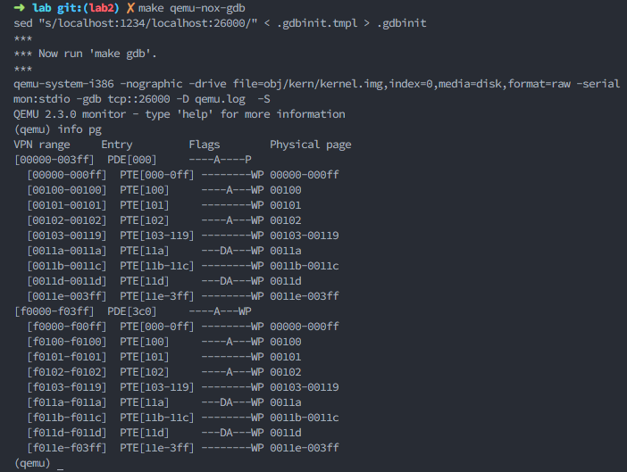
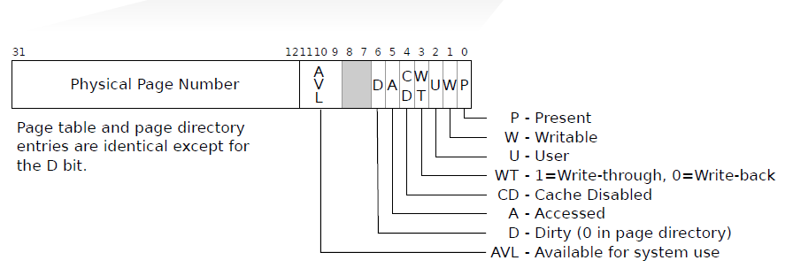
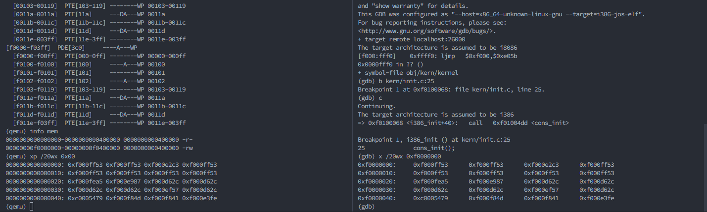

# Lab 2: Memory Management
在这个实验中需要给操作系统写内存管理的代码。内存管理主要有两部分。  
第一部分是内核的物理内存申请和释放，操作的最小单位是一个物理页（4KB）。  
第二部分是虚拟内存，虚拟地址的映射以及用户程序的物理寻址。

将代码切换到lab2分支
```bash
git checkout -b lab2 origin/lab2
git merge lab1  
```
合并lab1的代码到lab2,如果出现冲突需要先解决冲突在合并。lab2新增的代码
- `inc/memlayout.h`
- `kern/pmap.c`
- `kern/pmap.h`
- `kern/kclock.h`
- `kern/kclock.c`


## Part1: Physical Page Management
操作系统必须实时跟踪哪一部分的物理RAM是空闲的和可用的。JOS是以页的粒度管理内存，所以它可以使用MMU映射和保护每一块分配的内存。  
写一个物理页分配器。在实现虚拟内存之前需要完成物理页的分配器，因为页表管理的代码需要分配物理内存存在页表中。

#### Exercise1:
> 实现 `kern/pmap.c` 中下面的函数：
>- `boot_alloc()` //  分配n bytes大小的空间，空间大小以PAGE大小向上取整。
>- `mem_init()`  (only up to the call to `check_page_free_list(1)`)
>- `page_init()` // 将可使用的内存以链表的形式连接在一起。
>- `page_alloc()`  // 分配一个空闲page
>- `page_free()`   // 与上面的功能相反，收回一个空闲页。  
>
>`check_page_free_list()` 和 `check_page_alloc()` 用于测试物理页分配器。启动JOS观察 `check_page_alloc()` 是否成功。可以添加自己的 `assert()` 验证假设是否成功。

`boot_alloc(uint32_t n)` 这个函数是在系统建立虚拟内存映射的时候使用，后面所有的内存分配单位都是页（PAGA），并且使用`page_alloc` ， `boot_alloc()` 的函数完整代码：
```c++
static void *
boot_alloc(uint32_t n)
{
	static char *nextfree;	// virtual address of next byte of free memory
	char *result;

	// Initialize nextfree if this is the first time.
	// 'end' is a magic symbol automatically generated by the linker,
	// which points to the end of the kernel's bss segment:
	// the first virtual address that the linker did *not* assign
	// to any kernel code or global variables.
	// end 是链接脚本中的一个变量，表示的是内核最后的内存的地址（虚拟地址）
	if (!nextfree) {
		extern char end[];
		nextfree = ROUNDUP((char *) end, PGSIZE);  // 获取内核存放地址下一个4KB（PGSIZE）对齐的内存地址
	}

	// Allocate a chunk large enough to hold 'n' bytes, then update
	// nextfree.  Make sure nextfree is kept aligned
	// to a multiple of PGSIZE.
	//
	// LAB 2: Your code here.
	result = nextfree;
	if ((uint32_t)nextfree-KERNBASE > (npages*PGSIZE)) {
		panic("OUT OF MEMORY");
	}
	nextfree = ROUNDUP(nextfree + n, PGSIZE);  // 更新下一个空闲页的地址

	return result;
}
```
在 `mem_init()`补充代码, 分配用于存放页表的物理空间：
```c++
//////////////////////////////////////////////////////////////////////
// Allocate an array of npages 'struct PageInfo's and store it in 'pages'.
// The kernel uses this array to keep track of physical pages: for
// each physical page, there is a corresponding struct PageInfo in this
// array.  'npages' is the number of physical pages in memory.  Use memset
// to initialize all fields of each struct PageInfo to 0.
// Your code goes here:
// 分配用于存放页表信息的物理空间
pages = (struct PageInfo*)boot_alloc(npages * sizeof(struct PageInfo));
memset(pages, 0, npages * sizeof(struct PageInfo));  // 清空分配的空间
```

物理内存总共有 131072KB（128MB），因此需要 131072/4 = 32768 个 `PageInfo` 管理，每一 `PageInfo` 都会管理一个物理页。


物理内存分布：


JOS 将内存分成了四个部分：
1. [0-4KB): IDT表， BIOS （不可用）
2. [4-640)KB： base memory （不可用）
3. [640-1024)： IO hole （不可用）
4. [1024, ...) （可用， 但是前面一部分被内核占用了）

物理内存的获取是通过IO指令读取CMOS的数，相关参考资料
- [CMOS参考资料](https://wiki.osdev.org/CMOS),
- [CMOS 芯片](https://web.stanford.edu/class/cs140/projects/pintos/specs/mc146818a.pdf)
- [Detecting_Memory_(x86)](https://wiki.osdev.org/Detecting_Memory_(x86))

---

`page_init()` 函数主要是将物理悲内存中空闲的部分以链表的形式存储起来，也就是初始化 `pages` 数组，将所有的内存都记录下来， `page_init()` 函数的完整代码：

```c++
//
// Initialize page structure and memory free list.
// After this is done, NEVER use boot_alloc again.  ONLY use the page
// allocator functions below to allocate and deallocate physical
// memory via the page_free_list.
//
void
page_init(void)
{
	// The example code here marks all physical pages as free.
	// However this is not truly the case.  What memory is free?
	//  1) Mark physical page 0 as in use.
	//     This way we preserve the real-mode IDT and BIOS structures
	//     in case we ever need them.  (Currently we don't, but...)
	//     页0， 存放IDT
	//  2) The rest of base memory, [PGSIZE, npages_basemem * PGSIZE)
	//     is free. 
	//	   基址（640KB)剩下的内存
	//  3) Then comes the IO hole [IOPHYSMEM, EXTPHYSMEM), which must
	//     never be allocated. 
	// 	   IO hole 的内存不能使用
	//  4) Then extended memory [EXTPHYSMEM, ...).  所有剩下的物理内存
	//     Some of it is in use, some is free. Where is the kernel
	//     in physical memory?  Which pages are already in use for
	//     page tables and other data structures?
	//     所有剩下的物理内存，这些并不都是空闲内存，部分内页是有数据的，比如内核。
	//
	// Change the code to reflect this.
	// NB: DO NOT actually touch the physical memory corresponding to
	// free pages!
	size_t i;

	// page_in_use_end 没有使用的内存地址的开始位置（页），即使用了的结束位置
	// npages_basemem = 640K / 4k , 640KB 的基址的物理页
	// (1MB - 640KB)/4KB = 96  ， IO hole的物理页
	// ((uint32_t)boot_alloc(0) - KERNBASE) /PGSIZE  内核使用的物理页, 
	const size_t page_in_use_end = 
			npages_basemem + 96 + ((uint32_t)boot_alloc(0) - KERNBASE) / PGSIZE;

	// page_in_use_end = 600， 已经使用了物理页
	cprintf("now in used: %d\n", page_in_use_end);

	// 设置page0为使用
	cprintf("%08x %08x\n", pages, (uint32_t)boot_alloc(0));

	// 1. 0-4KB, page0 存放IDT，
	pages[0].pp_ref = 1;

	// 2. 4-640KB
	for (i = 1; i < npages_basemem; i++) {
		pages[i].pp_ref = 0;
		pages[i].pp_link = page_free_list;
		page_free_list = &pages[i];
	}
	// 3. 640 - used,  I/O hole 和 内核代码
	for(i = npages_basemem; i < page_in_use_end; ++i) {
		pages[i].pp_ref = 1;
	}

	// 4. kernel_end~... ，内核代码后面的都是空闲内存
	for (i = page_in_use_end; i < npages; i++) {
		pages[i].pp_ref = 0;
		pages[i].pp_link = page_free_list;
		page_free_list = &pages[i];
	}
}
```
物理内存的初始化，空闲物理内存被存放在一个链表中，`page_free_list` 是链表的头。注意，这个链表的方向和pages数组的方向是相反的，比如pages[1...n] 是空闲的物理内存，链表的结构是 `pages[n]->pages[n-1]->...->pages[0]->NULL`。 所以空闲物理内存的链表的头节点指向的是空闲物理内存数组最后一个空闲的物理页，pages 数组元素 pp_link的指向也是反向的。
 
<!-- TODO  将page_free_list的顺序改成和pages数组的顺序一致 -->
---

`struct PageInfo* page_alloc(int alloc_flags)` 分配物理内存

```c++
//
// Allocates a physical page.  If (alloc_flags & ALLOC_ZERO), fills the entire
// returned physical page with '\0' bytes.  Does NOT increment the reference
// count of the page - the caller must do these if necessary (either explicitly
// or via page_insert).
//
// Be sure to set the pp_link field of the allocated page to NULL so
// page_free can check for double-free bugs.
//
// Returns NULL if out of free memory.
//
// Hint: use page2kva and memset
struct PageInfo *
page_alloc(int alloc_flags)
{
	// Fill this function in
	struct PageInfo* temp;
	if (page_free_list == NULL) {  // 没有空闲的物理内存
		return NULL;
	}
	// 空闲内存页的链表操作，删除头节点
	// page_free_list 指向新的头节点
	temp = page_free_list;
	page_free_list = temp->pp_link;
	temp->pp_link = NULL;
	if (alloc_flags & ALLOC_ZERO) {
		//因为所有的程序中的地址都是虚拟地址进行操作的，所以我们需要将真实的物理页面转换到虚拟地址下初始化
		memset(page2kva(temp), 0, PGSIZE);
	}
	return temp;
}
```


---

`void page_free(struct PageInfo *pp)` 把需要释放的内存添加到空闲链表的头，注意一些先决条件：
```c++
//
// Return a page to the free list.
// (This function should only be called when pp->pp_ref reaches 0.)
//
void
page_free(struct PageInfo *pp)
{
	// Fill this function in
	// Hint: You may want to panic if pp->pp_ref is nonzero or
	// pp->pp_link is not NULL.
	// 当前还存在引用的或是 pp_link 不是NULL的内存允许释放
	if (pp->pp_ref != 0 || pp->pp_link != NULL) {
		panic("can't properly free page\n");
	}
	pp->pp_link = page_free_list;
	page_free_list = pp;
}
```

## Part2: Virtual Memory
在完成下面的任务前。请先确保你熟悉X86的保护模式以及内存管理：分段和分页。

#### Exercise2:
> 查看 [Intel 80386 Reference Manual](https://pdos.csail.mit.edu/6.828/2018/readings/i386/toc.htm) 的第5和6章，阅读关于页转换和基于页的保护(5.2~6.4)。分段机制相关的章节也最好阅读一下。


### Virtual, Linear, and Physical Addresses
X86 的分段和分页的内存管理机制比较复杂，在另一个文档 [分页机制](./分页机制.md) 有简要的介绍。


在lab1的part3，我简单的设置了页表并且将前4MB的内存地址映射到 0xf0000000 起始的虚拟地址，内核运行的地址在 0xf0100000。在本实验我们将映射前256MB内存到虚拟地址，0xf0000000.

#### Exercise3:
> 在QEMU的终端 `Ctrl-a c` 进入调试模式，使用 `xp` 命令（查看物理地址），在GDB中使用`x` 命令（查看线性地址），观察得到的是不是一样的数据
> 使用课程修改过的QEMU，有提供 `info pg` 命令，可以查看页表信息。当然官方的QEMU也有这样的命令，是 `info mem`。


`info pg` 查看的页表信息如下图所示：


`info mem` 查看的内存映射信息：


这个与代码中的一致，我们只设置了页目录表的第0和960(0x3c0) 项。`entrypadir.c` 
```c++
__attribute__((__aligned__(PGSIZE)))
pde_t entry_pgdir[NPDENTRIES] = {
	// Map VA's [0, 4MB) to PA's [0, 4MB)
	[0]
		= ((uintptr_t)entry_pgtable - KERNBASE) + PTE_P,
	// Map VA's [KERNBASE, KERNBASE+4MB) to PA's [0, 4MB)
	[KERNBASE>>PDXSHIFT]
		= ((uintptr_t)entry_pgtable - KERNBASE) + PTE_P + PTE_W
};
```
页目录表和页表的表项都是4个字节，其结构如下：


页目录和页表都是4KB对齐的，所以只要20位就可以索引到一个物理页，剩下的12位作为标志，表示对应的页属性。
```c++
// Page table/directory entry flags.
#define PTE_P		0x001	// Present 是否存在
#define PTE_W		0x002	// Writeable 读/写
#define PTE_U		0x004	// User 用户/超级用户
#define PTE_PWT		0x008	// Write-Through  
#define PTE_PCD		0x010	// Cache-Disable
#define PTE_A		0x020	// Accessed 已访问
#define PTE_D		0x040	// Dirty 已修改
#define PTE_PS		0x080	// Page Size
#define PTE_G		0x100	// Global
```

在QEMU中查看物理地址 0x0和在gdb中查看虚拟地址0xf0000000的数据，可以观察到它们是一样的：
  


在进入保护模式之后，我们就不能之间操作线性地址或物理地址。所有的内存地址都会被认为是虚拟地址，然后又MMU转换成物理地址，这意味着在C语言中的指针变量的值都是虚拟地址。  
JOS内核经常需要把地址作为一个数值来操作，而不是对地址进行解引用。在JOS的代码中使用 `uintptr_t` 表示虚拟地址的数值，使用 `physaddr_t` 物理地址的值，这两个类型其实都是 `uint32` 。在内核代码的地址操作，实际是操作的 `uint32_t` 数值，所以不能对地址解引用，否则编译器会报错。  
JOS内核可是先把 `uintptr_t` 转换成指针类型，然后再解引用。但是对于 `physaddr_t` 不能这样操作，因为即使转换成了指针类型，它也只是虚拟地址，并不是真实的物理地址。  
总的来说，这几个类型的对应关系如下：
```
C Type    	Address type
T*		  	Virtual
uintptr_t	Virtual
physaddr_t	Physical
```

#### Question
> 假设下面的内核代码是正确的，则x的类型是什么， `uintptr_t` 还是 `physaddr_t`
> ```c++
> mystery_t x;
> char* value = return_a_pointer();
> *value = 10;
> x = (mystery_t) value;
> ```

`x` 的值是一个虚拟地址。  


在内核中我们经常需要读写物理地址或虚拟地址，JOS提供了两个宏实现物理地址和虚拟地址的转换，分别是 `KADDR(pa)`(物理地址转换成虚拟地址)， `PADDR(kva)` 虚拟地址转换成物理地址。对应的还有两个函数（函数内部就是调用了这两个宏）`pa2page(physaddr_t pa)` 和 `page2kva(struct PageInfo *pp)`

### Reference counting
在后面的实验中，你经常需要把某个物理内存映射到多个不同的虚拟地址，为此我们需要一个变量保存引用计数, `PageInfo` 的 `pp_ref` 变量就是保存引用计数的。
```c++
// PageInfo 记录的不是物理地址本身
struct PageInfo {
	// Next page on the free list.
	// 下一个空闲的物理页地址
	struct PageInfo *pp_link;

	// pp_ref is the count of pointers (usually in page table entries)
	// to this page, for pages allocated using page_alloc.
	// Pages allocated at boot time using pmap.c's
	// boot_alloc do not have valid reference count fields.
	// 引用计数, 记录有多少个虚拟地址映射到该物理地址
	uint16_t pp_ref;
};
```
当一个地址的引用变成0，就可以释放该内存。使用 `page_alloc` 分配的内存返回的 `PageInfo` 引用计数是0， 所以在操作之前需要对引用计数自增。


### Page Table Management
完成下面关于页管理的函数：

#### Exercise4
> 在 `kern/pmap.c` 实现下面函数：
> `pgdir_walk()`
> `boot_map_region()`
> `page_lookup()`
> `page_remove()`
> `page_insert()`
> 在 `mem_init()` 中调用 `check_page()` 测试上面函数是否成功实现。


`pte_t* pgdir_walk(pde_t *pgdir, const void *va, int create)` : 给一个页目录的指针 pgdir, 返回 `va` 指向的页表项地址。若此 pte 没有被初始化，则通过 `create` 参数判断是否新建页，并返回 pte.
```c++
pte_t *
pgdir_walk(pde_t *pgdir, const void *va, int create)
{
	// Fill this function in
	pde_t* pgdir_entry = pgdir + PDX(va); // 页目录首地址+页目录项的索引（va的高10bit)
	if (!(*pgdir_entry & PTE_P)) {  // 不存在
		if (!create) {
			return NULL;
		} else {  // 创建
			struct PageInfo* new_page = page_alloc(1);
			if (!new_page) {
				return NULL;
			}
			// 设置新页目录项的标志位
			*pgdir_entry = (page2pa(new_page) | PTE_P | PTE_W | PTE_U);
			++new_page->pp_ref;
		}
	}
	return (pte_t*)(KADDR(PTE_ADDR(*pgdir_entry))) + PTX(va);
}
```

---


`static void boot_map_region(kern_pgdir, uintptr_t va, size_t size, physaddr_t pa, int perm)`： 通过地址区间，将虚拟地址和物理地址进行映射。 将 [va, va+size) 的虚拟地址空间映射到 [pa, pa+size)的物理空间：

```c++
static void
boot_map_region(pde_t *pgdir, uintptr_t va, size_t size, physaddr_t pa, int perm)
{
	// Fill this function in
	int offset;
	pte_t* pgtable_entry;
	for (offset = 0; offset < size; 
	offset +=PGSIZE, va += PGSIZE, pa += PGSIZE) {
		pgtable_entry = pgdir_walk(pgdir, (void*) va, 1);
		*pgtable_entry = (pa | perm | PTE_P);
	}
}
```

---

`page_insert(pde_t *pgdir, struct PageInfo *pp, void *va, int perm)`:
若该虚拟地址之前已经建立映射了，那么取消原来的映射关系（即将原来的pg table entry内容移除），并且将新的映射关系记录下来。
```c++
int
page_insert(pde_t *pgdir, struct PageInfo *pp, void *va, int perm)
{
	// Fill this function in
	pte_t* pgtable_entry = pgdir_walk(pgdir, va, 1);
	if (!pgtable_entry) {
		return -E_NO_MEM;
	}
	++pp->pp_ref;
	if ((*pgtable_entry) & PTE_P) {
		tlb_invalidate(pgdir, va);
		page_remove(pgdir, va);
	}
	*pgtable_entry = (page2pa(pp) | perm | PTE_P);
	*(pgdir + PDX(va)) |= perm;
	return 0;
}
```

---


`struct PageInfo *page_lookup(pde_t *pgdir, void *va, pte_t **pte_store)`, 找到虚拟地址对应的页地址。

```c++
struct PageInfo *
page_lookup(pde_t *pgdir, void *va, pte_t **pte_store)
{
	// Fill this function in
	pte_t* pgtable_entry = pgdir_walk(pgdir, va, 0);
	if (!pgtable_entry || !(*pgtable_entry & PTE_P)) {
		return NULL;
	}
	if (pte_store) {
		*pte_store = pgtable_entry;
	}
	return pa2page(PTE_ADDR(*pgtable_entry));
}
```

---
`page_remove()`: 将虚拟地址建立的映射关系取消。

```c++
void
page_remove(pde_t *pgdir, void *va)
{
	// Fill this function in
	pte_t *pgtable_entry;
	struct PageInfo* page = page_lookup(pgdir, va, &pgtable_entry);
	if (!page) {
		return;
	}
	page_decref(page);
	tlb_invalidate(pgdir, va);
	*pgtable_entry = 0;
}
```


