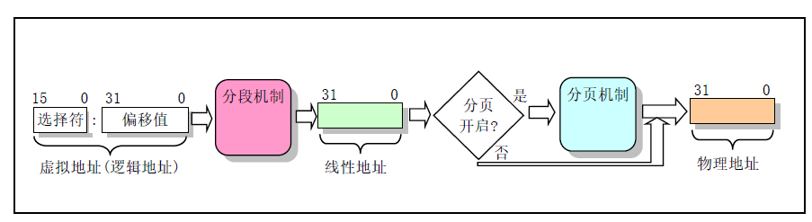
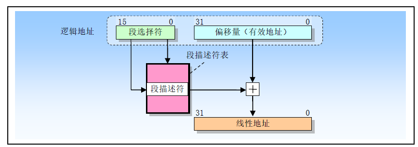
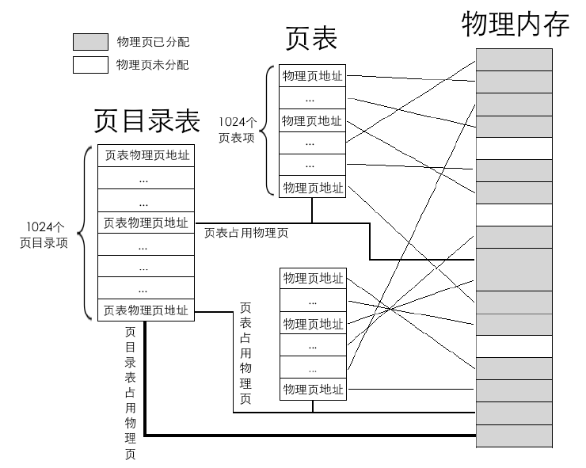
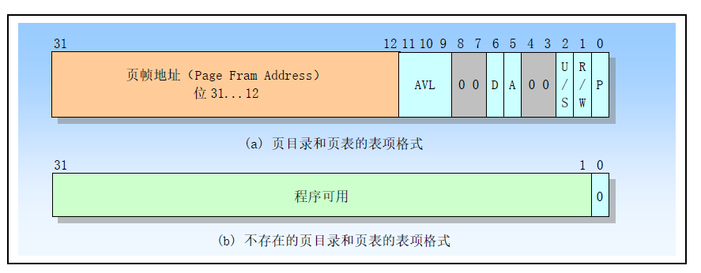
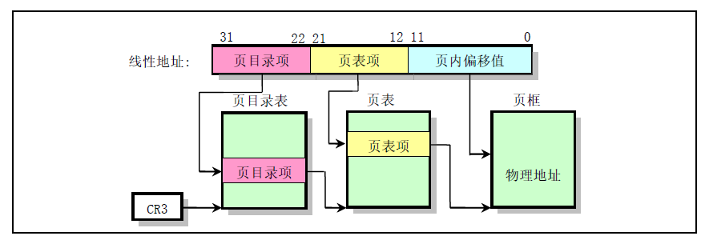

# 内存分页

内存的访问方式有分段和分页，其大致流程如下：

## 1. 内存分段
内存分段的基本思想就是 `段基址:偏移地址 = 虚拟地址` 段基址保存在段寄存器，无论实模式还是保护模式段寄存器都是16bit。

### 实模式的分段
实模的中，`段基址:偏移地址` 对应的地址是 `段基址*16 + 偏移地址` ,该地址就是物理地址，无须再进一步的转换

### 保护模式下的分段
保护模式下的内存分段是需要先定义一个GDT（全局描述符表），GDT的每一个表项（GD， 描述符）就是一个内存段。每个描述符是8个字节，描述了内存段的起始位置，偏移位置，段属性等信息。GDT在内存中的位置保存在`gdtr` 寄存器中。

保护模式下，段寄存器又叫段选择子，它给出了的是段在GDT中的索引值以及权限和GDT/LDT：

`偏移地址` 是段内的偏移，因此保护模式下的分段流程:

在没有开启分页的情况下，线性地址直接对应物理地址

## 2. 内存分页
内存分页功能开启是将控制寄存器 `CR0` 的 `PG` 位置1。

二级页表示意图, 页目录表和页表的每个表项都是4个字节，每个物理页是4KB：

页目录表和页表的表项内容：

开启分页机制后，线性地址到物理地址的转换:

`CR3` 寄存器是保存页目录表的物理地址